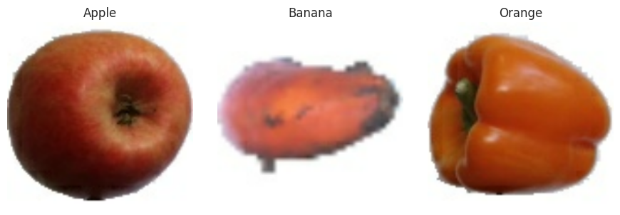
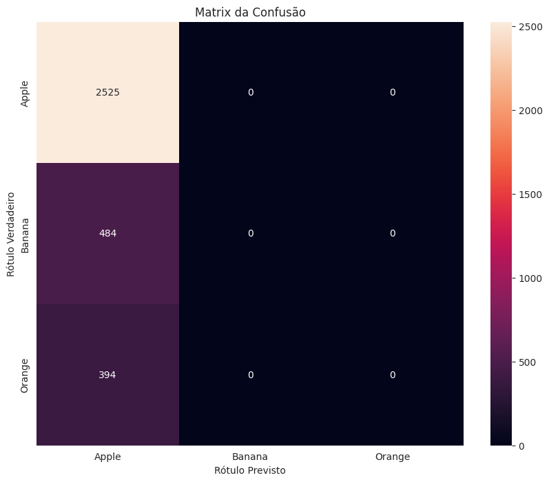

Você foi contratado para criar um sistema que realiza a classificação de imagens de frutas para uma empresa de e-commerce. O objetivo é que, ao enviar uma imagem, o sistema identifique se a fruta é uma maçã, uma banana ou uma laranja. Sabendo que você possui um banco de imagens já categorizado, explique quais tipos de redes neurais você utilizaria para resolver esse problema, como seria o processo de implementação utilizando Python e quais etapas principais precisam ser seguidas para treinar o modelo.
Padrão de Resposta para a Atividade:

- Indicação clara do tipo de rede neural usada e justificativa do porquê de ser a escolha mais adequada;
- Descrição do processo de pré-processamento das imagens;
- Apresentação do modelo de rede neural em Python, com uma breve explicação de cada camada;
- Compilação e treinamento do modelo, mencionando a função de perda e o otimizador usados;
- Processo de avaliação e validação do modelo;
- Conclusão explicando como o modelo resolverá o problema proposto.

```python
import matplotlib.pyplot as plt
from sklearn.metrics import confusion_matrix, classification_report, ConfusionMatrixDisplay
import numpy as np
import tensorflow as tf
from tensorflow.keras.utils import to_categorical

def evaluate_model(best_model, data_test):
    # Avaliação do modelo no conjunto de teste
    loss, accuracy = best_model.evaluate(data_test)
    print(f"Avaliação no conjunto de teste:\nLoss: {loss}\nAccuracy: {accuracy}")
    return loss, accuracy

def plot_confusion_matrix(best_model, data_test, class_names):
    # Obter rótulos verdadeiros e previstos
    y_true = np.concatenate([y for x, y in data_test], axis=0)
    y_pred = tf.argmax(best_model.predict(data_test), axis=1)

    # Matriz de confusão
    cm = confusion_matrix(y_true, y_pred, labels=np.arange(len(class_names)))
    disp = ConfusionMatrixDisplay(confusion_matrix=cm, display_labels=class_names)

    # Plotar
    disp.plot(cmap=plt.cm.Blues)
    plt.title("Matriz de Confusão")
    plt.show()

def classification_report_model(best_model, data_test, class_names):
    # Obter rótulos verdadeiros e previstos
    y_true = np.concatenate([y for x, y in data_test], axis=0)
    y_pred = tf.argmax(best_model.predict(data_test), axis=1)

    # Relatório de classificação
    report = classification_report(y_true, y_pred, target_names=class_names)
    print(f"Relatório de Classificação:\n{report}")

```
## Oficina 2: Sistema de classificação de imagens## 1. IntroduçãoO objetivo do projeto é criar um sistema capaz de receber uma imagem de uma fruta e retornar a sua classificação como sendo uma maça, banana ou laranja, para isso é necessário criar um modelo de aprendizado supervisionado capaz de reconhecer caracteríticas das frutas pretendidas por meio de um banco de imagens pré-rotuladas.### Bibliotecas

- **Seaborn**, biblioteca em python foi utilizada para gerar gráfico de comparação da acurácia ao longo das epochs.
- **Scikit-learn**, para clasular métricas de avaliação.
  - confusion_matrix: Matriz de confusão para análise de desempenho.
  - classification_report: Relatório com precisão, recall e F1-score.
- **Tensor-flow**, para o carregamento e tratamento dos dados utilizados na modelagem e para a criação, treinamento e avaliação de modelo de classificação.
- **Numpy**, para conversão de imagens em array multidimensionais.
- **TensorFlow**, para construção e treinamento de modelos de deep learning.
- **Keras** (tensorflow.keras), API de alto nível para redes neurais (integradas ao TensorFlow).
  - Sequential: Modelo sequencial para empilhar camadas.
  - layers: Camadas pré-definidas (ex: Conv2D, MaxPooling2D, Dense).
  - ImageDataGenerator: Pré-processamento e aumento de dados para imagens.


```python
import pandas as pd
import seaborn as sns
import sklearn as sk
import numpy as np
import tensorflow as tf
import zipfile
import os
import matplotlib.pyplot as plt
import cv2
import numpy as np
from PIL import Image
from tensorflow import keras
from tensorflow.keras import layers
from tensorflow.keras.models import Sequential
from tensorflow.keras.preprocessing.image import ImageDataGenerator
from sklearn.metrics import confusion_matrix, classification_report
from sklearn.model_selection import train_test_split
import os

```
## 2. Compreensão dos Dados

```python
# O caminho para os diretórios de treinamento e teste são armazenados nas seguintes variáveis:
train_path = "/home/adsr/Documentos/cjovem/Uece-C-Jovem/Ciência de Dados - Avançado/aux/360fruits/teste"
test_path = "/home/adsr/Documentos/cjovem/Uece-C-Jovem/Ciência de Dados - Avançado/aux/360fruits/treinamento"
```


```python
def count_images_in_directory(directory):
    count = 0
    for root, dirs, files in os.walk(directory):
        count += len(files)
    return count

train_count = count_images_in_directory(train_path)
test_count = count_images_in_directory(test_path)

print(f"Quantidade de imagem para Treinamento e Validação: {train_count}")
print(f"Quantidade de imagens para Teste: {test_count} \n")

# Calculate and display metrics for each subdirectory
def calculate_metrics(directory):
    metrics = {}
    if os.path.exists(directory):
        for subdir in os.listdir(directory):
            subdir_path = os.path.join(directory, subdir)
            if os.path.isdir(subdir_path):
                metrics[subdir] = count_images_in_directory(subdir_path)
    return metrics

train_metrics = calculate_metrics(train_path)
test_metrics = calculate_metrics(test_path)

print("Quantidade de imagens para Treinamento e Validação por fruta:")
for fruit, count in train_metrics.items():
    print(f"{fruit}: {count} images")
print("\n")
print("Quantidade de imagens para Teste por fruta:")
for fruit, count in test_metrics.items():
    print(f"{fruit}: {count} images")
```

    Quantidade de imagem para Treinamento e Validação: 7180
    Quantidade de imagens para Teste: 3403 
    
    Quantidade de imagens para Treinamento e Validação por fruta:
    Banana: 1430 images
    Apple: 4569 images
    Orange: 1181 images
    
    
    Quantidade de imagens para Teste por fruta:
    Banana: 484 images
    Apple: 2525 images
    Orange: 394 images


**Mostra das imagens que estão no diretório e sua respectivas classes:**


```python
train_data = tf.keras.preprocessing.image_dataset_from_directory(
    train_path,
    labels="inferred"
)

class_names = train_data.class_names
num_classes = len(class_names)
samples = [None] * num_classes

for images, labels in train_data:
    for img, lbl in zip(images, labels):
        lbl_idx = lbl.numpy()
        if samples[lbl_idx] is None:
            samples[lbl_idx] = img
    if all(sample is not None for sample in samples):
        break

fig, axes = plt.subplots(1, num_classes, figsize=(num_classes * 3, 3))

for i in range(num_classes):
    axes[i].imshow(samples[i].numpy().astype("uint8"))
    axes[i].set_title(class_names[i])
    axes[i].axis("off")

plt.tight_layout()
plt.show()
```

    Found 7180 files belonging to 3 classes.


    

    

## 3. Preparação de dados**A dimensão das imagens é definida para 100 de altura e 100 de largura, isso é importante para o modelo de rede neural que será criado posteriormente,
pois o algoritmo espera que todas as imagens tenham o mesmo tamanho.**

```python
import tensorflow as tf
from tensorflow.keras.preprocessing.image import ImageDataGenerator

# Cria um gerador de dados para treinamento com aumento de dados
train_datagen = ImageDataGenerator(
    rotation_range=20,  # Rotação aleatória
    width_shift_range=0.2,  # Deslocamento horizontal
    height_shift_range=0.2,  # Deslocamento vertical
    shear_range=0.2,  # Transformação (corte) na imagem
    zoom_range=0.2,  # Zoom aleatório
    horizontal_flip=True,  # Inversão horizontal
    fill_mode='nearest',  # Como preencher novos pixels criados pela rotação/deslocamento
    validation_split=0.2  # Reservar parte das imagens para validação
)

# Cria um gerador de dados para a validação (sem aumentar dados, geralmente)
val_datagen = ImageDataGenerator(
    validation_split=0.2
)

# Esses caminhos devem apontar para o diretório de treinamento
# com subpastas para cada classe
train_path = "/home/adsr/Documentos/cjovem/Uece-C-Jovem/Ciência de Dados - Avançado/aux/360fruits/teste"

# Gera lotes de dados de treinamento
train_generator = train_datagen.flow_from_directory(
    train_path,
    target_size=(100,100),  # Tamanho padronizado das imagens
    batch_size=32,
    class_mode='sparse',
    subset='training'
    # Subconjunto de treinamento
)

# Gera lotes de dados de validação
val_generator = val_datagen.flow_from_directory(
    train_path,
    target_size=(100, 100),  # Tamanho padronizado das imagens
    batch_size=32,
    class_mode='sparse',
    subset='validation'  # Subconjunto de validação
)


```

    Found 5745 images belonging to 3 classes.
    Found 1435 images belonging to 3 classes.


```python
img_widht = 100
img_height = 100

```
**O dicionário dataset_params define parâmetro que será utilizados no carregamento das imagens no ambiente tf.kera:**

- **labels:** "inferred" significa que as labels serão inferidas dos nomes das pastas
- **label_mode:** "int" indica que as labels serão números inteiros
- **image_size:** Define o tamanho das imagens (largura e altura)
- **color_mode:** "rgb" especifica imagens coloridas com 3 canais
- **batch_size:** Define 32 imagens por lote
- **shuffle:** Embaralha os dados durante o treinamento
- **validation_split=0.2:** Separa 20% dos dados para validação
- **subset="training":** Indica que este é o conjunto de treino
- **seed=123:** Garante reprodutibilidade no embaralhamento


```python
dataset_params = {
    "labels": "inferred",
    "label_mode": "int",
    "image_size": (img_widht, img_height),
    "color_mode": "rgb",
    "batch_size": 32,
    "shuffle": True,
    "seed": 42
}
```
**As imagens são carregadas do diretório de treino e de teste usando os parâmetros definidos anteriormente. A fim do acompanhamen durante o treinamento, são reservados dos dados de treinamento 20% para fim de validação.**


```python

class_names = data_train.class_names

data_test = tf.keras.preprocessing.image_dataset_from_directory(
    test_path,
    **dataset_params,
    
    
)


```

    Found 3403 files belonging to 3 classes.

## 4. Modelagem**O modelo escolhido para o alcançar o objetivo do projeto foi a Redes Neurais Convolucionais (CNNs) pois ela explora muito bem a estrutura espacial dos dados de imagem, oferece eficiência computacional e uma robusta capacidade de generalização para novas amostras.**

**O modelo possui as seguintes características:**

- A primeira camada convolucional (Conv2D) com 32 filtros e kernel 3×3, com ReLU, extrai características iniciais das imagens, que possuem tamanho 100×100 e 3 canais (RGB).
- A camada de MaxPooling2D reduz a dimensionalidade e o custo computacional, mantendo características importantes.
- A segunda camada convolucional aumenta a complexidade das características extraídas com 64 filtros, seguida por outra camada de pooling para novo downsampling.
- A função Flatten converte os dados multidimensionais em um vetor unidimensional para a fase densa.
- A camada Dense com 128 neurônios utiliza a ativação ReLU para aprender combinações não lineares das características extraídas.
- A camada final Dense com 3 unidades e softmax gera a probabilidade de cada uma das 3 classes, sendo o softmax ideal para problemas de classificação.

```python
from tensorflow.keras import layers, models, regularizers
from tensorflow.keras.layers import Dropout

model.add(layers.Dense(512, activation='relu', kernel_regularizer=regularizers.l2(0.01)))

model = models.Sequential([
    layers.Conv2D(32, (3, 3), activation='relu'),
    layers.MaxPooling2D((2, 2)),
    layers.Conv2D(64, (3, 3), activation='relu'),
    layers.MaxPooling2D((2, 2)),
    layers.Flatten(),
    layers.Dense(128, activation='relu'),
    layers.Dense(3, activation='softmax'),

])
model.add(layers.Dense(512, activation='relu', kernel_regularizer=regularizers.l2(0.01)))


model.add(Dropout(0.5))


```
- **Otimizador Adam: adapta automaticamente a taxa de aprendizado**
- **Loss function 'sparse_categorical_crossentropy': ideal para classificação multiclasse**
- **Métricas de accuracy para avaliar performance**

```python
model.compile(optimizer='adam',
              loss='sparse_categorical_crossentropy',
              metrics=['accuracy'])
```


```python
from tensorflow.keras.callbacks import (
    ModelCheckpoint,
    EarlyStopping,
    ReduceLROnPlateau,
    TensorBoard,
    CSVLogger
)
import datetime
import os

# Criar diretório para salvar logs e checkpoints se não existir
log_dir = "logs/fit/" + datetime.datetime.now().strftime("%Y%m%d-%H%M%S")
checkpoint_dir = "checkpoints"
os.makedirs(log_dir, exist_ok=True)
os.makedirs(checkpoint_dir, exist_ok=True)

# 1. ModelCheckpoint - Salva o melhor modelo durante o treinamento
checkpoint_callback = ModelCheckpoint(
    filepath=os.path.join(checkpoint_dir, 'model_best.h5'),
    monitor='val_accuracy',  # métrica para monitorar
    mode='max',  # queremos maximizar a acurácia
    save_best_only=True,  # salva apenas o melhor modelo
    verbose=1
)

# 2. EarlyStopping - Para o treinamento se não houver melhoria
early_stopping = EarlyStopping(
    monitor='val_loss',
    patience=7,  # número de épocas para aguardar melhoria
    restore_best_weights=True,
    verbose=1
)

# 3. ReduceLROnPlateau - Reduz a taxa de aprendizado quando as métricas estagnam
reduce_lr = ReduceLROnPlateau(
    monitor='val_loss',
    factor=0.2,  # fator de redução da taxa de aprendizado
    patience=3,  # número de épocas para aguardar melhoria
    min_lr=1e-6,  # menor taxa de aprendizado permitida
    verbose=1
)

# 4. TensorBoard - Para visualização do treinamento em tempo real
tensorboard_callback = TensorBoard(
    log_dir=log_dir,
    histogram_freq=1,  # frequência de cálculo dos histogramas
    write_graph=True,
    write_images=True,
    update_freq='epoch'
)

# 5. CSVLogger - Salva as métricas em um arquivo CSV
csv_logger = CSVLogger(
    'training_log.csv',
    separator=',',
    append=False  # se False, sobrescreve o arquivo existente
)

# Lista com todos os callbacks
callbacks = [
    checkpoint_callback,
    early_stopping,
    reduce_lr,
    tensorboard_callback,
    csv_logger
]


```
- **O treinamento do modelo é feito usando o dataset de treinamento (data_train), durante 10 épocas, com lotes de 64 amostras.**
- **Durante o treinamento, o desempenho é validado utilizando o conjunto data_val.**
- **O objeto history armazena os valores da perda e da acurácia para cada época, permitindo analisar a evolução do treinamento e a performance do modelo durante o processo.**

```python
history = model.fit(
    train_generator,  # Imagens de treinamento e rótulos de treinamento incluídos no tf.data.Dataset
    epochs=5,  # Número de épocas
    validation_data=val_generator,  # Dados de validação
    batch_size=32,
    callbacks=callbacks
)
```

    /home/adsr/myenv/lib/python3.12/site-packages/keras/src/trainers/data_adapters/py_dataset_adapter.py:121: UserWarning: Your `PyDataset` class should call `super().__init__(**kwargs)` in its constructor. `**kwargs` can include `workers`, `use_multiprocessing`, `max_queue_size`. Do not pass these arguments to `fit()`, as they will be ignored.
      self._warn_if_super_not_called()


    Epoch 1/5
    180/180 ━━━━━━━━━━━━━━━━━━━━ 0s 246ms/step - accuracy: 0.2475 - loss: 9.3171
    Epoch 1: val_accuracy improved from -inf to 0.63624, saving model to checkpoints/model_best.h5


    WARNING:absl:You are saving your model as an HDF5 file via `model.save()` or `keras.saving.save_model(model)`. This file format is considered legacy. We recommend using instead the native Keras format, e.g. `model.save('my_model.keras')` or `keras.saving.save_model(model, 'my_model.keras')`. 


    180/180 ━━━━━━━━━━━━━━━━━━━━ 54s 290ms/step - accuracy: 0.2486 - loss: 9.3059 - val_accuracy: 0.6362 - val_loss: 6.2422 - learning_rate: 0.0010
    Epoch 2/5
    180/180 ━━━━━━━━━━━━━━━━━━━━ 0s 198ms/step - accuracy: 0.5823 - loss: 6.2422
    Epoch 2: val_accuracy did not improve from 0.63624
    180/180 ━━━━━━━━━━━━━━━━━━━━ 40s 220ms/step - accuracy: 0.5822 - loss: 6.2422 - val_accuracy: 0.6362 - val_loss: 6.2398 - learning_rate: 0.0010
    Epoch 3/5
    180/180 ━━━━━━━━━━━━━━━━━━━━ 0s 210ms/step - accuracy: 0.5727 - loss: 6.2397
    Epoch 3: val_accuracy did not improve from 0.63624
    180/180 ━━━━━━━━━━━━━━━━━━━━ 44s 246ms/step - accuracy: 0.5729 - loss: 6.2397 - val_accuracy: 0.6362 - val_loss: 6.2394 - learning_rate: 0.0010
    Epoch 4/5
    180/180 ━━━━━━━━━━━━━━━━━━━━ 0s 218ms/step - accuracy: 0.6462 - loss: 6.2394
    Epoch 4: val_accuracy did not improve from 0.63624
    180/180 ━━━━━━━━━━━━━━━━━━━━ 43s 240ms/step - accuracy: 0.6461 - loss: 6.2394 - val_accuracy: 0.6362 - val_loss: 6.2393 - learning_rate: 0.0010
    Epoch 5/5
    180/180 ━━━━━━━━━━━━━━━━━━━━ 0s 223ms/step - accuracy: 0.6322 - loss: 6.2393
    Epoch 5: val_accuracy did not improve from 0.63624
    180/180 ━━━━━━━━━━━━━━━━━━━━ 47s 258ms/step - accuracy: 0.6322 - loss: 6.2393 - val_accuracy: 0.6362 - val_loss: 6.2392 - learning_rate: 0.0010
    Restoring model weights from the end of the best epoch: 5.


```python
best_model = tf.keras.models.load_model(os.path.join(checkpoint_dir, 'model_best.h5'))
```

    WARNING:absl:Compiled the loaded model, but the compiled metrics have yet to be built. `model.compile_metrics` will be empty until you train or evaluate the model.

**Este dois gráficos mostram a evolução da acurácia e da perda do modelo ao longo das épocas de trainamento**

```python
accuracy, loss = history.history['accuracy'], history.history['loss']
val_accuracy, val_loss = history.history['val_accuracy'], history.history['val_loss']

plt.plot(loss, label="Training Loss")
plt.plot(accuracy, label="Training Accuracy")

plt.legend()
```


    <matplotlib.legend.Legend at 0x724f797b0680>


    

    

## 5. Avaliação

```python


y_pred = best_model.predict(data_test)
y_pred_classes = np.argmax(y_pred, axis=1)

y_true = np.concatenate([y for x, y in data_test], axis=0)

class_names = ["Apple", "Banana", "Orange"]
print("\nRelatório de classificação:")
print(classification_report(y_true, y_pred_classes, target_names=class_names))

cm = confusion_matrix(y_true, y_pred_classes)
plt.figure(figsize=(10, 8))
sns.heatmap(cm, annot=True, fmt="d", xticklabels=class_names, yticklabels=class_names)
plt.title("Matrix da Confusão")
plt.ylabel("Rótulo Verdadeiro")
plt.xlabel("Rótulo Previsto")
plt.show()
##
```

    107/107 ━━━━━━━━━━━━━━━━━━━━ 5s 43ms/step
    
    Relatório de classificação:
                  precision    recall  f1-score   support
    
           Apple       0.74      1.00      0.85      2525
          Banana       0.00      0.00      0.00       484
          Orange       0.00      0.00      0.00       394
    
        accuracy                           0.74      3403
       macro avg       0.25      0.33      0.28      3403
    weighted avg       0.55      0.74      0.63      3403
    


    /home/adsr/myenv/lib/python3.12/site-packages/sklearn/metrics/_classification.py:1565: UndefinedMetricWarning: Precision is ill-defined and being set to 0.0 in labels with no predicted samples. Use `zero_division` parameter to control this behavior.
      _warn_prf(average, modifier, f"{metric.capitalize()} is", len(result))
    /home/adsr/myenv/lib/python3.12/site-packages/sklearn/metrics/_classification.py:1565: UndefinedMetricWarning: Precision is ill-defined and being set to 0.0 in labels with no predicted samples. Use `zero_division` parameter to control this behavior.
      _warn_prf(average, modifier, f"{metric.capitalize()} is", len(result))
    /home/adsr/myenv/lib/python3.12/site-packages/sklearn/metrics/_classification.py:1565: UndefinedMetricWarning: Precision is ill-defined and being set to 0.0 in labels with no predicted samples. Use `zero_division` parameter to control this behavior.
      _warn_prf(average, modifier, f"{metric.capitalize()} is", len(result))


    

    


```python

```
